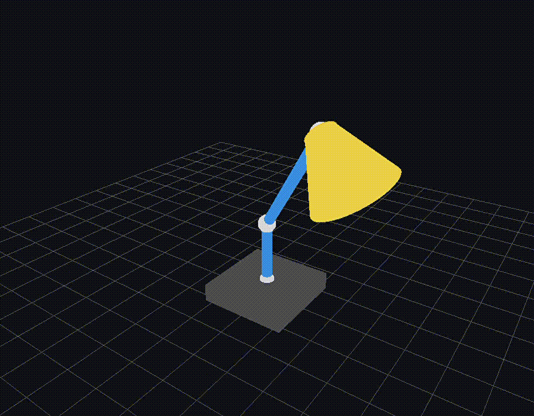

# Assignment1_HierarchicalModeling
https://stormy-airbus-32f.notion.site/Assignment-1-Hierarchical-Modeling-17f690c00943806dba77f04f65f77501


FK anim 구현.



## 실행 환경

* OS: Windows
* Python: 3.14
* pyglet: 2.1
* PyOpenGL-3.1

## 문서 구조
```
Assignment1_HierarchicalModeling
└── hierarchical_modeling/
│   ├── .venv/ 
│   ├── Assignment1_main/
│   │   └── Assignment1_main.py # 메인 실행 스크립트
│   │   └── Assignment1_HierarchicalModel-3D-Stand-Lamp-2026-05-14-23-58-22.gif  # 영상
│   └── Assignment1_main.slnx # 솔루션 구성 파일
```


부모 좌표계의 변환 × 자식 좌표계의 변환 = 자식의 월드 좌표계 변환.<br>
Hierarchical modeling에서 각 관절의 local angle만 저장.<br>
실제 화면에 그릴 때는 부모 변환들을 전부 곱해서 global position/orientation을 계산.<br>

<br>
이 모델은 base, upper arm, forearm, hand로 구성된 kinematic tree이다.<br>
각 node는 parent에 대한 local transformation을 가진다.<br>
각 joint angle은 시간에 따라 변하고,<br>
최종 global transformation은 root부터 현재 node까지의 transformation matrix product로 계산된다.<br>


## 모델 설명
```
        Base
          └── Neck Joint
                └── Neck Link
                      └── Arm Joint
                            └── Arm Link
                                  └── Lamp Head

```


* 1단계: Base-원기둥 본체
* 2단계: Lower Arm (Link 1)-꺽인 목 원기둥
* 3단계: Lamp Head (Link 2)- 원뿔 (조명부분)

    전체 변환은 부모에서 자식 방향으로 누적.

        T_bulb = T_base * T_neck * T_arm * T_head * T_bulb_local

    
p0 = base_top: 받침대 위, 세로 파란 기둥 시작점<br>
p1 = neck_end: 세로 기둥과 긴 파란 팔이 꺾이는 관절<br>
2 = arm_end: 긴 파란 팔과 노란 조명 갓이 만나는 관절<br>
p3 = head_end: 노란 조명 갓의 넓은 끝 방향 중심점<br>


## 함수 설명
* perspective: glFrustum으로 perspective projection 설정
* align_y_axis_to_vector : local y축을 링크 방향으로 회전 ->로드리게스 회전공식
(0, 1, 0) == 처음 생성되는 local y축 방향<br>
local y축 -> 이동 회전-> 월드에 배치<br>
	
* draw_cylinder_y : local 좌표계에서 Y축 방향 원기둥 생성
    bottom: y = 0
    top   : y = height

* draw_cylinder_between : 두 점 start, end 사이에 원기둥 링크 생성

* draw_frustum_y : local Y축 방향 절두체모양 원뿔 생성

* draw_frustum_between:start에서 end 방향으로 절두원뿔 생성

* draw_sphere :UV sphere 생성

* draw_floor_grid :3D 공간감 확인용 바닥 격자


* draw_stand_lamp : 
					Base :바닥 위 원기둥 받침대
					└── Lower Arm : Base의 상단 중앙에서 시작하는 꺾인 목
							└── Lamp Head :중간 팔 끝단에 연결된 원뿔형 전등 갓


